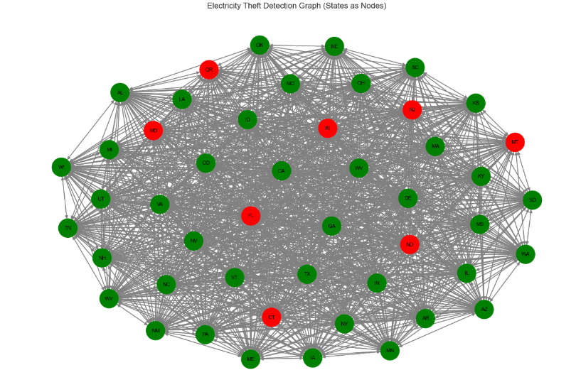
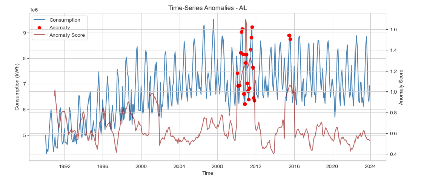
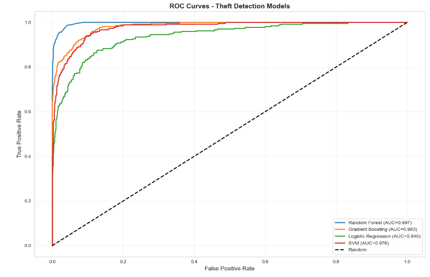

# AI-Driven Electricity Theft Detection Using Machine Learning, Graph Neural Networks, and Hybrid Decision Fusion

## Overview

Electricity theft remains one of the major causes of revenue loss and operational inefficiency in modern power distribution systems. This project develops a machine learning-based framework for detecting potentially fraudulent electricity consumption patterns using historical consumption data and engineered behavioral features.

The objective is to automatically identify suspicious consumption behavior and support utility providers in prioritizing inspections and reducing non-technical losses.

## Research Publication

This project accompanies the research paper:

**AI-Driven Electricity Theft Detection Using Machine Learning, Graph Neural Networks, and Hybrid Decision Fusion**

**Authors:** AbdulQoyum A. Olowookere, Adewale U. Oguntola, Ebenezer Leke Odekanle

**arXiv Preprint:** https://arxiv.org/abs/2603.14406

### Citation

```bibtex
@article{olowookere2026electricity,
  title={AI-Driven Electricity Theft Detection Using Machine Learning, Graph Neural Networks, and Hybrid Decision Fusion},
  author={Olowookere, AbdulQoyum A. and Oguntola, Adewale U. and Odekanle, Ebenezer Leke},
  journal={arXiv preprint arXiv:2603.14406},
  year={2026}
}
```

The repository provides the implementation, experiments, visualizations, and evaluation results supporting the findings reported in the paper.


## Key Features

* Data preprocessing and feature engineering
* Exploratory data analysis and visualization
* Machine learning-based theft detection
* Customer risk classification
* Model evaluation using standard classification metrics
* Visual interpretation of model performance

## Project Structure

```text
Electricity/
│
├── Electricity.ipynb
├── electricity_consumption_dataset.xlsx
├── processed/
├── models/
├── visualizations/
├── README.md
└── .gitignore
```

## Methodology

1. Data collection and preprocessing
2. Feature engineering
3. Exploratory data analysis
4. Model training and validation
5. Performance evaluation
6. Visualization of results

## Technologies Used

* Python
* Pandas
* NumPy
* Scikit-learn
* Matplotlib
* Jupyter Notebook

## Results
## Model Performance Comparison

The performance of multiple machine learning models was evaluated for electricity theft detection using Precision, Recall, F1-Score, and ROC-AUC metrics.

| Model                        | Theft Precision | Theft Recall | Theft F1-Score | ROC-AUC |
| ---------------------------- | --------------- | ------------ | -------------- | ------- |
| Random Forest                | 0.981           | 0.749        | 0.849          | 0.997   |
| Gradient Boosting            | 0.959           | 0.687        | 0.801          | 0.983   |
| Support Vector Machine (SVM) | 0.511           | 0.876        | 0.645          | 0.976   |
| Logistic Regression          | 0.388           | 0.836        | 0.530          | 0.940   |

### Performance Analysis

* **Random Forest** achieved the best overall performance with a Theft F1-Score of **0.849** and an ROC-AUC of **0.997**, demonstrating excellent discrimination between legitimate and fraudulent consumption patterns.
* **Gradient Boosting** delivered strong predictive performance with an F1-Score of **0.801** and ROC-AUC of **0.983**.
* **SVM** achieved the highest theft recall (**0.876**), indicating strong capability in identifying theft cases, but generated more false positives, resulting in lower precision.
* **Logistic Regression** provided a useful baseline but underperformed compared to tree-based methods.
* Experimental evaluation showed that ensemble learning methods significantly outperform traditional linear models for electricity theft detection.

### Hybrid Framework Results

A hybrid framework combining anomaly detection, machine learning classification, and graph-based learning achieved:

* Overall Accuracy: **93.7%**
* Theft Precision: **0.55**
* Theft Recall: **0.50**
* Improved balance between fraud detection and false alarm reduction.

These results demonstrate the effectiveness of combining statistical, machine learning, and graph-based approaches for smart-grid fraud detection.

### Key Findings

* The standalone anomaly detection model achieved high overall accuracy (91.0%) but struggled to distinguish theft events effectively, resulting in a theft-class F1-score of only 0.20.
* The Random Forest classifier demonstrated excellent discrimination capability, achieving a theft-class F1-score of 0.85 and an ROC-AUC score of 0.997.
* The Graph Neural Network improved theft recall to 0.71 by exploiting relationships among consumers and network structures.
* The proposed hybrid framework combined the strengths of statistical, machine learning, and graph-based approaches, achieving 93.7% overall accuracy while maintaining a better balance between precision (0.55) and recall (0.50) for theft detection.
* Results indicate that integrating multiple detection mechanisms can reduce false alarms while improving the identification of fraudulent consumption patterns.


## Visualizations

### Graph Representation of Electricity Consumption Network



### Time-Series Anomalies in Electricity Consumption (AL)



### ROC Curve




## Applications

* Smart grid monitoring
* Utility fraud detection
* Revenue protection
* Energy consumption analytics

## Authors

* AbdulQoyum A. Olowookere
* Adewale U. Oguntola
* Ebenezer Leke Odekanle

## Contact

For questions, collaborations, or research discussions, please open an issue in this repository or contact the authors through their institutional channels.


Machine Learning | Artificial Intelligence | Data Science | Energy Analytics
